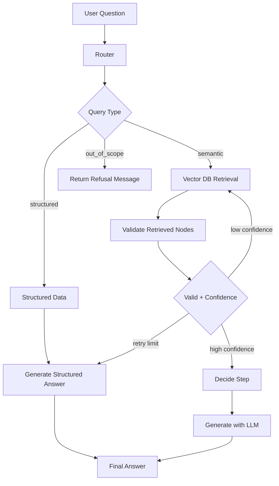

# RAG LlamaIndex Agent

## 📌 Overview

This project implements a Retrieval-Augmented Generation (RAG) agent using LlamaIndex.  
It processes user questions, routes them to the correct data source, retrieves relevant context, and generates grounded answers using an LLM.

The system is built as an event-driven workflow with clear separation between routing, retrieval, validation, and generation.

---

## ⚙️ Key Capabilities

- Intelligent query routing (structured / semantic / out-of-scope)
- Retrieval from vector database (Pinecone)
- Structured JSON knowledge extraction
- Confidence scoring for retrieved results
- Context-grounded LLM generation

---

## 🧠 System Components

### 🔀 Query Router
Classifies each question into:
- Structured data queries
- Semantic search
- Out-of-scope rejection

### 📥 Retrieval Layer
Retrieves relevant context from:
- Pinecone vector database
- Structured JSON knowledge base

### ✅ Validation Layer
- Filters irrelevant results
- Computes confidence score
- Ensures quality before generation

### 🧾 Generation Layer
- Uses LLM to generate final answer
- Strictly grounded in retrieved context

---

## 🚀 Setup Instructions

### 1. Install dependencies

```bash
uv sync
```

---

### 2. Environment variables

Create a `.env` file:

```env
COHERE_API_KEY=your_api_key
PINECONE_API_KEY=your_api_key
```

---

### 3. Run the project

```bash
uv run app.py
```

After running, a local Gradio interface will be available:

```
http://127.0.0.1:7860
```

---

## 📁 Project Structure

```
app.py                 # Application entry point
workflow.py            # Core RAG workflow (event-driven pipeline)
router.py              # Query classification logic
extractor.py           # Structured data extraction
structured_store.py    # JSON knowledge loader
models/                # Pydantic schemas
```

---

## 💬 Example Queries

### Information retrieval
- How do I install dependencies?
- What is Bun in this project?
- How does the system work?

### Structured data queries
- Show me all decisions
- List system rules

### Out-of-scope handling
- External/general knowledge questions are rejected or ignored

---

## 🔁 Architecture Flow

User Input  
→ Router (classification)  
→ Retrieval (vector / structured)  
→ Validation (filter + scoring)  
→ LLM Generation  
→ Final Answer  

---

## 🔄 Workflow Diagram

